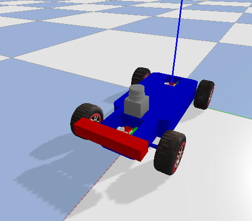
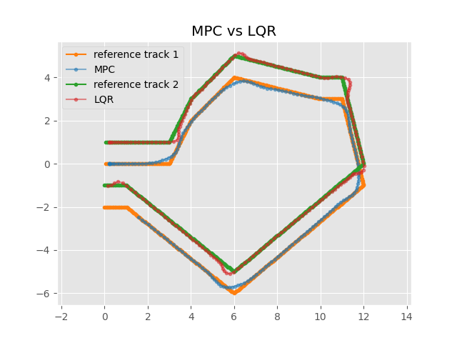

# MPC vs LQR
Includes a Pybullet simulation to demo 2 controllers. Both cars follow smooth reference paths visualized in yellow, with real-time debug lines indicating their positions. As the cars navigate the track, the black car’s trajectory is plotted in red lines, and the white car’s trajectory in blue lines, demonstrating smooth and precise path tracking.

## Contents

### Usage

* To run the pybullet demo:
```bash
python3 LQR_MPC.py
```

* To run the simulation-less demo (simpler demo that does not use pybullet, useful for debugging):
```bash
python3 mpc_demo_nosim.py
```

In both cases the script will promt the user for `enter` before starting the demo.

The settings for tuning the MPC controller are in the **[mpc_config](./mpc_pybullet_demo/mpcpy/mpc_config.py)** class.

### Results

Racing car model is from: *https://github.com/erwincoumans/pybullet_robots*.




Additional Results:



## Acknowledgments
Parts of this project page were adopted from the [Nerfies](https://nerfies.github.io/) page.

## Website License
<a rel="license" href="http://creativecommons.org/licenses/by-sa/4.0/"></a><br />This work is licensed under a <a rel="license" href="http://creativecommons.org/licenses/by-sa/4.0/">Creative Commons Attribution-ShareAlike 4.0 International License</a>.
